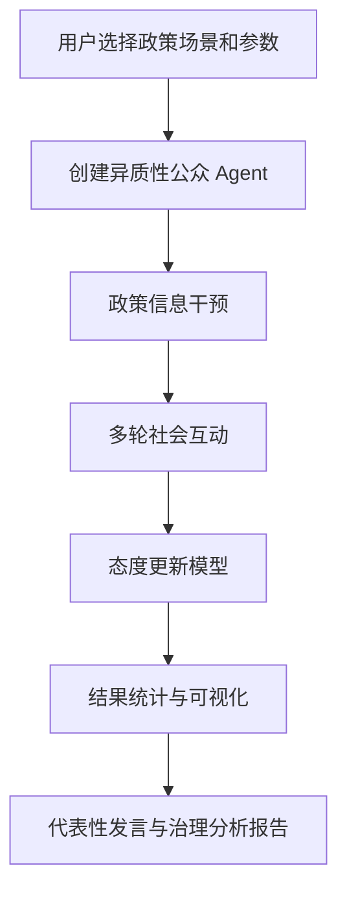

# PolicyPulse-Agent：公共治理场景下的多智能体态度演化模拟系统

## 一句话简介
PolicyPulse-Agent 是一个面向 AI×公共治理与计算社会科学的多智能体模拟原型，用于观察不同类型公众在 AI 治理政策议题、政策沟通和社会互动影响下的态度演化过程。

## 项目背景
生成式 AI 正在快速进入教育、内容平台、公共数据开放、金融风控和城市治理等场景。围绕这些议题，社会讨论往往并不只涉及“技术能不能用”，还涉及公众是否接受、是否信任制度安排、是否担心风险外溢，以及是否认为治理过程公平、透明、可问责。

因此，AI 治理不仅是技术监管问题，也是公共管理和人文社科问题。PolicyPulse-Agent 以 Multi-Agent Simulation 为基础，构建了一个轻量、可解释的实验型系统，用于展示异质性公众在不同政策场景和信息干预下的态度变化、群体分化与治理含义。

## 核心功能
- 多政策场景选择：支持“生成式 AI 进入高校课堂”“生成式 AI 内容监管”“城市公共摄像头治理”“金融 AI 风控透明度”“公共数据开放治理”等议题
- 异质性公众 Agent 建模：内置技术乐观型、风险敏感型、制度信任型、权益保护型、功利效率型、中立观望型六类公众画像
- 政策信息干预：支持官方政策解释、专家理性说明、负面新闻冲击、社交媒体情绪传播、平衡型公共讨论等干预方式
- 多轮社会互动与态度更新：基于政策信息、邻域互动、风险感知与阻尼机制进行多轮演化
- 平均态度变化可视化：展示群体平均态度的动态趋势
- 支持 / 中立 / 反对比例可视化：展示群体立场结构的变化过程
- 不同 Agent 类型态度差异可视化：展示各类公众在同一议题下的分化路径
- 代表性 Agent 发言：自动生成更贴近不同公众类型的代表性表达
- 公共治理分析报告：输出正式、克制、面向 AI 治理与政策沟通讨论的分析文本

## 技术栈
- Python
- Streamlit
- pandas
- numpy
- plotly
- pydantic
- pytest

## 系统架构
项目采用 Streamlit 单体应用结构，不额外拆分复杂前后端：
- `app.py` 负责页面交互、参数输入、结果展示
- `src/` 负责 Agent 模型、政策场景、模拟逻辑、图表和报告
- `tests/` 负责基础单元测试



## 项目结构
```text
PolicyPulse-Agent/
├── README.md
├── requirements.txt
├── .gitignore
├── .env.example
├── AGENTS.md
├── app.py
├── sample_reference.jsonl
├── src/
│   ├── __init__.py
│   ├── models.py
│   ├── scenarios.py
│   ├── simulator.py
│   ├── charts.py
│   ├── report.py
│   └── utils.py
├── tests/
│   ├── test_models.py
│   └── test_simulator.py
├── examples/
│   ├── demo_case_education.md
│   └── demo_case_ai_governance.md
├── docs/
│   ├── architecture.md
│   └── usage.md
└── assets/
    └── .gitkeep
```

## 快速开始
### 1. 安装依赖
```bash
pip install -r requirements.txt
```

### 2. 启动项目
```bash
streamlit run app.py
```

### 3. 运行测试
```bash
python -m pytest
```

## 示例场景
- 生成式 AI 进入高校课堂
- 生成式 AI 内容监管
- 城市公共摄像头治理
- 金融 AI 风控透明度
- 公共数据开放治理

## 参考语料说明
- 项目主流程不依赖大文件语料，可直接运行
- `sample_reference.jsonl` 仅作为轻量示例数据，用于展示项目如何接入参考讨论语料
- `train.jsonl` 与 `validation.jsonl` 这类大型语料文件不会随 GitHub 仓库上传，建议仅在本地研究或扩展实验时使用

## API Key 说明
本项目当前版本默认使用规则模型和模板报告，不依赖真实 API Key；未来可扩展 LLM 生成代表性发言和分析报告。

## 项目价值
- 适合用于 AI 治理、公共管理、政策传播、计算社会科学方向的课程展示或申请材料
- 能较直观地呈现异质性公众、风险感知、制度信任和群体分化之间的关系
- 保持解释性、轻量化和可演示性，适合作为 GitHub 展示项目

## 局限性
- 本系统是解释性、探索性的 AI×社会科学模拟原型，不构成对真实社会行为或政策结果的预测
- Agent 参数与更新规则是研究化抽象，不代表真实人口统计结构
- 社会互动网络经过简化，未引入复杂拓扑和真实舆情传播机制
- 报告与代表性发言为规则生成结果，更适合作为展示型输出，而非正式政策评估

## 简历写法
可以参考以下表述：

> 独立开发 PolicyPulse-Agent 多智能体公共治理模拟系统，基于 Python、Streamlit、Pandas、NumPy、Plotly 与 Pydantic 构建可解释的 AI 治理态度演化原型，支持异质性公众建模、政策信息干预、多轮社会互动、态度变化可视化与自动治理分析报告生成，用于 AI×公共管理与计算社会科学研究展示。
