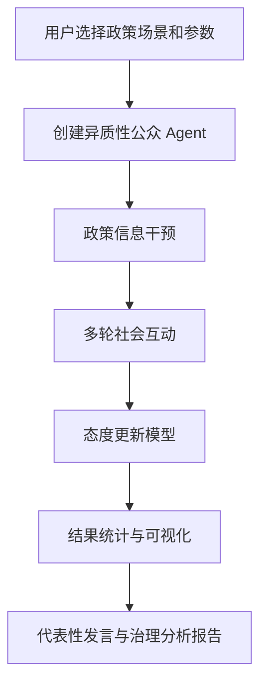

# 系统架构说明

PolicyPulse-Agent 采用轻量级 Streamlit 单体应用结构，不拆分复杂前后端，适合课程展示、研究原型和 GitHub 作品集呈现。

## 架构分层
- `app.py`：页面入口、参数交互、结果展示
- `src/models.py`：Pydantic 数据模型
- `src/scenarios.py`：政策场景、干预方式、Agent 模板
- `src/simulator.py`：多智能体创建、邻域互动、态度更新
- `src/charts.py`：Plotly 可视化
- `src/report.py`：代表性发言与治理分析报告
- `tests/`：基础单元测试

## 数据流

## 设计原则
- 保持解释性：更新机制尽量规则化、可说明
- 保持轻量：不引入数据库、复杂后端框架或部署系统
- 保持展示友好：页面简洁，输出结果适合教学和申请展示

